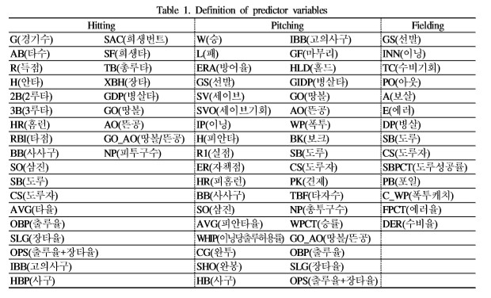
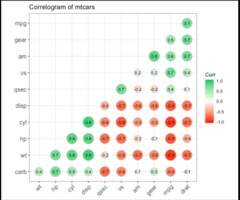

# 한국 프로야구 경기의 승률에 대한 분석 


1. 프로젝트 개요
1.1 분석목표
한국 프로야구 경기에서 다중회귀분석을 이용하여 승률을 추정하는 통계 모형을 제시하고 이를 바탕으로 다음 년도와 그 이듬해의 승률을 예측하여 구축한 모형이 실제 결과와 어느 정도 일치하는지 확인해보려고 한다.

1.2 분석방법
본 프로젝트에서는 2015년부터 2019년까지 5년간 팀별 기록을 수집하기 위하여 KBO 공식 홈페이지에서 타자부문, 투수부문 등으로 구분하여 각 분야에 해당하는 자료를 수집한다.
# (예시논문참고)변수설명

 
이중 승률을 반응변수 나머지 변수들을 설명변수로 하여서 다중회귀분석 모델로 가정한다.
승률(WR, %) = B_0+B_1 x_1+B_1 x_1+B_1 x_1.......+∈ 모델 가정
분석방법으로는 회귀분석, 상관관계분석 주성분분석등을 이용한다. 분석을 통해서 어떤 변수값이 승률에 영향을 많이 미치는지 알아낸다.

1.3 활용 데이터
KB0, STATIZ 야구기록 사이트







2. 데이터 분석(1차)
2.1 데이터 정제
설명변수의 수가 많기 때문에 데이터를 분석하기 전에 필요한 자료들만 추출하여 데이터를 정제한다.

2.2 데이터 불러오기
KBO 야구기록 개방사이트에서  팀별 기록을 수집하기 위해서 2015년부터 2019년까지
불러온다.(R이나 SAS활용)

2.3 타자데이터 만들기
-  원본데이터는 건들지 않고 코드를 통해 체계적으로 수집하고 정리하면 언제든 복구와 검증가능(SAS,R,파이썬)

2.4 투수데이터 만들기
-  원본데이터는 건들지 않고 코드를 통해 체계적으로 수집하고 정리하면 언제든 복구와 검증가능(SAS,,R,파이썬)

2.5 데이터 하나로 합치기
=> 데이터를 정규화하기(scale함수 사용 in R프로그래밍)
=> 알고리즘을 적용하기 전에는 원데이터를 정규화 하는 전처리 작업이 필요
이유? 데이터 왜곡이 없기 때문

2.6 산점도 통하여 연관성이 없어보이는 변수 제거(SAS프로그래밍)
=> 산점도를 통하여 선형성이나 일정한 패턴이 존재할 경우 두 변수 간에는 관계가 있음을 기준으로 상관관계가 낮게 나타난 변수들은 상관관계에서 제거하여 변수를 선정

2.7 산점도를 통한 변수 선택
=> 설명변수가 매우 많을것으로 예상하기 때문에 반응변수와 설명변수의 산점도를 통하여 연관성이 없어보이는 변수와 중복되는 변수를 제거후 다시 산점도 시각화 정리(SAS프로그래밍)

2.8 반응변수(승률)과 설명변수(득점, 세이브,홈런 등) 비교분석을 위해 데이터를 나눈다.
=> 산점도를 통해 선택된 변수들을 몇가지로 나누어 비교 분석=> 그래프시각화(R프로그래밍)






3. 데이터 분석(2차)

3.1 상관관계분석
 correlation chart plot과 corr plot 이용하여
시각화하여 각 변수들의 유의성이 있는지 확인
상관분석을 통해 설명변수간의 상관계수 관계 확인
(예시)(R프로그래밍)




3.2 주성분분석(PCA)
주성분분석을 통해 차원축소를 하고 쓸모없는 변수를 찾아 제거한다.
=> 주성분 분석이란 변수가 너무 많아 변수의 수를 줄여야 하는 경우에 사용되는 차원요약법이다. 주성분분석을 통해서 설명변수들이 가지고 있는 전체 변동을 잘 설명할수 있음, 중요한 몇 개의 변수들을 새롭게 생성해서 원레의 데이터를 적은 수의 새로운 변수로 요약

=> 주성분의 개수를 선정후 각 변수들의 관계에 대한 분석마다
어떤 변수를 설명하는지 시각화(pca plot)

3.3 다중공선성 확인 회귀식 추정

=> 다중공선성(VIF)을 확인하고 10이상인 변수확인(R프로그래밍이용)

3.4 stepwise이용하여 회귀식 추정 및 최종모형선정(SAS프로그래밍이용)
=> 모형의 통계량 확인 및 잔차의 정규성 검정
=> 최종 모형 선정

4. 머신러닝 적용(선택)(파이썬orR이용)
5. 결론(회귀모형선정)
=> 최종 회귀모형을 통해서 각 변수별 양의 상관관계 또는 음의 상관관계 표현하여
테이블로 나타내어 년도별 승률 예측
